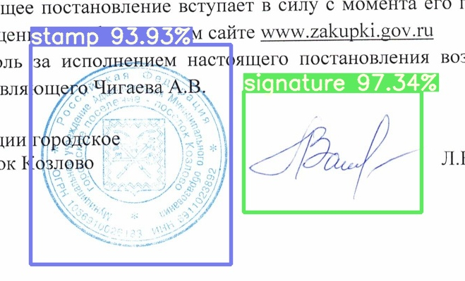

# Signex


Signex is open source signature & stamp recognition tool, that uses YOLOv7-based model for signature detection and ...
for signature embeddings.

# Table of Contents

* [Introduction](#introduction)
* [Structure](#structure)
* [Requirements](#requirements)
* [Installation](#installation)
* [Training](#training)
* [Usage](#usage)
* [Contributing](#contributing)
* [License](#license)

# Introduction

Signature & stamp recognition is a valuable tool in various domains, including banking, legal, and security
applications. This architecture provides a framework for building a signature recognition system using machine learning
algorithms.

# Requirements

To run the signature recognition architecture, the following requirements should be fulfilled:

* Linux or Windows machine, this project was not tested on Mac
* GPU and [CUDA 11.8](https://developer.nvidia.com/cuda-11-8-0-download-archive) for training

# Installation

## Step-by-step guide

<details>
   <summary>Click to expand and follow these steps</summary>

1. If you are going to train custom models,
   install [CUDA 11.8](https://developer.nvidia.com/cuda-11-8-0-download-archive)
2. Clone the repository:
   ```shell
   git clone --depth 1 --recurse-submodules https://gitlab.pg.innopolis.university/sofwarus-progectus/signature-recognition.git
   ```
3. Navigate to the project:
   ```shell
   cd signature-recognition
   ```
4. Create Python virtual environment:
   ```shell
   python -m venv venv
   ```
5. Activate venv:

   **Linux:**
   ```shell
   . venv/bin/activate
   ``` 
   **Windows:**
   ```
   venv\Scripts\activate
   ```
6. Install the requirements:
   ```shell
   pip install -r requirements.txt
   ```

</details>

## Linux:

```shell
git clone --depth 1 --recurse-submodules https://gitlab.pg.innopolis.university/sofwarus-progectus/signature-recognition.git
cd signature-recognition
python -m venv venv
. venv/bin/activate
pip install -r requirements.txt
```

## Windows:

```shell
git clone --depth 1 --recurse-submodules https://gitlab.pg.innopolis.university/sofwarus-progectus/signature-recognition.git
cd signature-recognition
python -m venv venv
venv\Scripts\activate
pip install -r requirements.txt
```

## Usage

### Detection Model

To run trained Neural Network execute the following command:

```shell
python yolov7/detect.py --weights ./weights/best.pt --conf 0.5 --img-size 640 --source images_dir
```

<div style="display: flex;">
  
  
</div>

### Comparison Model

# Training

## Detection Model

### Structure

* [cfg](cfg) - neural network configurations folder
* [data](data) - dataset configurations folder
* [hyp](hyp) - hyperparameters for training neural network, such as learning rate, augmentation strategies, etc.

### Dataset preparation

To train your custom model:

1. Collect images for the dataset
2. Convert all images to `.jpg` format and check their validity
3. Label the data, we recommend to use [YOLO Label](https://github.com/developer0hye/Yolo_Label). This project uses
   standard YOLO labels format:
    ```
    <class_id> <cx> <cy> <w> <h>   
    ```
   Where:
    1. `class_id` - marked object class/type, `&isin; [0, # of clases]`
    2. `cx` - `x` coordinate of the bounding box center, `&isin; [0, 1]`
    3. `cy` - `y` coordinate of the bounding box center, `&isin; [0, 1]`
    4. `w` - `width` of the bounding box, `&isin; [0, 1]`
    5. `h` - `height` of the bounding box, `&isin; [0, 1]`

   **Note:** `cx`, `cy`, `w`, and `h` are values relative to the corresponding image dimensions


5. Put or symlink all images and labels in the [dataset/images](dataset/images) and [dataset/labels](dataset/labels)
   folders. Each label file name should correspond to the image file:
    ```
   image_1.jpg <-> image_1.txt
   ball.jpg <-> ball.txt
    ```
6. Change classes number in [cfg/net.yaml](cfg/net.yaml):
   ```yaml
   nc: 2 # number of classes
   ```
7. Create [dataset/train.lst](dataset/train.lst) and [dataset/test.lst](dataset/test.lst) files, that will contain paths
   to
   the training and testing images. You can use `shufflels` tool to create them automatically:
    1. Build `shufflels`:
       ```shell
       g++ shufflels.cpp -o shufflels
       ```
    2. Run `shufflels`:
       ```shell
       cd dataset
       ./shufflels images jpg 80
       ```
8. You can specify custom [train.lst]() and [test.lst]() paths in the [data/data.yaml](data/data.yaml) file:
    ```yaml
   train: dataset/list.lst # path to images list used for training
   val: dataset/list.lst # path to images list used for testing
    ```
9. Specify number and names of the classes in the [data/data.yaml](data/data.yaml) file:
    ```yaml
   nc: 2 # number of classes in the dataset
   names: ['signature', 'stamp'] # names of the classes
    ```

10. Optionally you can modify hyperparameters in [hyp/hyp.net.yaml](hyp/hyp.net.yaml)

11. Start training
    ```shell
    python yolov7/train.py --workers 8 --device 0 --batch-size 64 --data data/data.yaml --img 640 640 --cfg cfg/net.yaml --weights '' --name net --hyp hyp/hyp.net.yaml
    ```

### Comparison Model

## Contributing

We welcome contributions to enhance the signature recognition architecture. If you would like to contribute, please
follow these steps:

1. Fork the repository on GitLab.

2. Create a new branch with the name `feature/feature_name` for your feature or bug fix.

3. Implement your changes or additions.

4. Commit and push your changes to your forked repository.

5. Submit a merge request, clearly describing the changes you have made.

## License

Signex is licensed under the [WTFPL](LICENSE.fuck).
