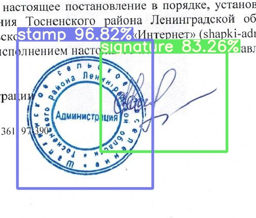

# Signex


Signex is open source signature & stamp recognition tool, that uses YOLOv7-based model and
modified [Pytorch](https://github.com/ATMI/yolov7) framework for signature detection and ... for signature embeddings. 

## Table of Contents

* [Introduction](#introduction)
* [Structure](#structure)
* [Requirements](#requirements)
* [Installation](#installation)
* [Training](#training)
* [Usage](#usage)
* [Contributing](#contributing)
* [License](#license)

## Introduction

Signature & stamp recognition is a valuable tool in various domains, including banking, legal, and security
applications. This architecture provides a framework for building a signature recognition system using machine learning
algorithms.

## Structure

   * [cfg/](cfg/) - Folder with neural network configurations 
   * [data/](data/) - Folder with dataset configurations 
   * [hyp/](hyp/) - Folder with hyperparameters for training neural network, such as learning rate, weight decay, etc.


## Requirements

To run the signature recognition architecture, the following requirements should be fulfilled:

* Linux machine, this project was not tested on Windows & Mac
* Sufficient computing resources (CPU/GPU) for training and inference

## Installation

1. Clone the repository:

   **SSH:**
   ```shell
      git clone —depth 1 --recurse-submodules git@gitlab.pg.innopolis.university:sofwarus-progectus/signature-recognition.git
   ```

   **HTTPS:** 
   ```shell
      git clone —depth 1 --recurse-submodules https://gitlab.pg.innopolis.university/sofwarus-progectus/signature-recognition.git
   ```

2. Navigate to project

   ```shell
      cd signature-recognition
   ```
3. Set up and activate virtual environment
   ```shell
      python -m venv venv
   ```
   **Linux:**
   ```shell
      . venv/bin/activate
   ``` 
   **Windows:**
   ```
      venv\Scripts\activate
   ```    
4. Install requirements
   ```shell
      pip install -r requirements.txt
   ```  

5. Optionally you can install:

* OpenCV - version 4.x
* CUDA & cuDNN

## Build


## Training 

### Detection Model

To train your custom model:

1. Download/prepare dataset with label tools. We reccomend to use [YOLO Label](https://github.com/developer0hye/Yolo_Label).

2. Put all images and labels that will be used for training model in the [dataset/train](dataset/train) folder. Currently all training images should be `.jpg`. Each label file name should correspond to the image file. Label format is the same as Darknet label format.

3. Put images and labels in the [dataset/test](dataset/test) for testing the trained model.

4. Change classes number in [cfg/net.yaml](cfg/net.yaml):
   ```shell
      nc: ...
   ```

5. Modify [data/data.yaml](data/data.yaml):
   - `train: path/to/list.lst` - Set the directory to dataset list for training model
   - `val: path/to/test/list.lst` - Set the directoru to list for testing trainde model
   - `nc:` - Set number of classes
   - `names: ['First class', 'Second class']` - Add class names

6. Optionally you can modify hyperparameters in [hyp/hyp.net.yaml](hyp/hyp.net.yaml)

7. Start training
   ```shell
      python yolov7/train.py --workers 8 --device <GPU_NUM> --batch-size <B_SIZE> --data data/data.yaml --img <SIZE_X> <SIZE_Y> --cfg cfg/net.yaml --weights '' --name <TRAINING_NAME> --hyp hyp/hyp.net.yaml
   ```
   **Command Parameters**
   - `--workers 8`: Number of worker processes to use for data loading during training. You can increase this value to speed up data loading if you have sufficient CPU resources.

   - `--device <GPU_NUM>`: Specify the device (GPU) to be used for training. Exaple: --device 0

   - `--batch-size <B_SIZE>`: Number of samples in each training batch. Example: --batch-size 160

   - `--data data/data.yaml`: Path to the YAML file (`data.yaml`) containing dataset configuration, including the dataset location, number of classes, and other relevant information.

   - `--img <SIZE_X> <SIZE_Y>`: Size of the input images during training. Example: --img 640 640

   - `--cfg cfg/net.yaml`: Path to the YAML file (`net.yaml`) containing the network architecture configuration for the YOLOv7 model.

   - `--weights ''`: Path to the pre-trained weights file to initialize the model. Use an empty string (`''`) if you want to train the model from scratch.

   - `--name <TRAINING_NAME>`: Name for the training run. Example: --name Signex

   - `--hyp hyp/hyp.net.yaml`: Path to the YAML file (`hyp.net.yaml`) containing hyperparameters for training, such as learning rate, weight decay, etc.

### Comparison Model


## Usage

### Detection Model

To run trained Neural Network perform the following command:
   ```shell
   python yolov7/detect.py --weights ./weights/best.pt --conf <VAL> --img-size <SIZE> --source <PATH_TO_FOLDER_WITH_IMAGES>
   ```
   **Command Parameters**
   - `--weights ./weights/best.pt`: Path to the trained weights file of your YOLOv7 model.

   - `--conf <VAL>`: Confidence threshold for object detection (Example: 0.6). Objects with a detection confidence score below this threshold will be filtered out. 

   - `--img-size <SIZE>`: Size of the input images during detection. Ensure that this value matches the image size used during training. Example: 640




### Comparison Model

## Contributing

We welcome contributions to enhance the signature recognition architecture. If you would like to contribute, please
follow these steps:

1. Fork the repository on GitLab.

2. Create a new branch with the name `feature/feature_name` for your feature or bug fix.

3. Implement your changes or additions.

4. Commit and push your changes to your forked repository.

5. Submit a merge request, clearly describing the changes you have made.

## License

Signex is licensed under the [WTFPL](LICENSE.fuck).
